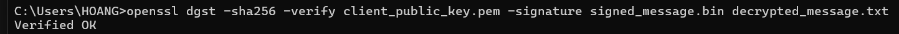

# Task 1: Public-key based authentication

## Installation OSSHand set up evironment

1. Goto [https://github.com/PowerShell/Win32-OpenSSH/releases](https://github.com/PowerShell/Win32-OpenSSH/releases)
2. Download the OpenSSH-Win64.zip file from the latest release
3. Extract the zip file contents to the folder `C:\Program Files\OpenSSH`

- Open a command prompt as Administrator and use the following command to change to openssh directory
  `cd "C:\Program Files\OpenSSH"`
- Run the following command
  `powershell.exe -ExecutionPolicy Bypass -File install-sshd.ps1`


- Change the startup type to Automatic from Manual and start both the `sshd` and `sshd-agent` services. Since we have set the startup type as automatic, both the services will start automatically upon system startup.


## Setup key pairs

**Open 2 terminal 1 Client 1 as Sever side**

### On client side

Make private_key

```
openssl genpkey -algorithm RSA -out client_private_key.pem
```

Write public Key

```
openssl rsa -pubout -in client_private_key.pem -out client_public_key.pem
```


**On server side**

Make private_key

```
openssl genpkey -algorithm RSA -out server_private_key.pem
```

Write public Key

```
openssl rsa -pubout -in client_private_key.pem -out server_public_key.pem
```


## Send Message from Server to Client

On server side

Make message

```
echo "This is a happy message" > message.txt
```


- Encrypt the challenge message with the client's public key:

  ```
  openssl pkeyutl -encrypt -inkey client_public_key.pem -pubin -in message.txt -out encrypted_message.bin
  ```

  

## Client Decrypts the Message

**Client Side**

- Decrypt the encrypted_challenge.bin file:

```
openssl pkeyutl -decrypt -inkey client_private_key.pem -in encrypted_message.bin -out decrypted_message.txt
```


- View the decrypted content:


## Client Signs the Decrypted Message

On Client:

- Sign the file decrypted_challenge.txt:

```
openssl dgst -sha256 -sign client_private_key.pem -out signed_message.bin decrypted_message.txt
```


## Server Verifies the Signature

On Server:

- Verify the signature:

```
openssl dgst -sha256 -verify client_public_key.pem -signature signed_message.bin decrypted_message.txt
```



Output is: Verified OK then COMPLETE

# Task 2: Encrypting large message

Create a text file 56 bytes.

**Question 1**: Encrypt the file with aes-256 cipher in CFB and OFB modes. How do you evaluate both cipher as far as error propagation and adjacent plaintext blocks are concerned. **Answer 1**:

## Create a Text File

Create a file with more than 56 bytes:

```
echo "This is a sample text file for encryption testing. It is more than 56 bytes long." > large_text_file.txt
```


## Generate AES Key and Initialization Vector

Generate a random 256-bit key for AES-256:

```
openssl rand -hex 32 > aes_key.txt
```


- Generate a random 128-bit IV:

```
openssl rand -hex 16 > aes_iv.txt
```

## Encrypt with AES-256-CFB Mode

- Encrypt the file:

```
openssl enc -aes-256-cfb -in large_text_file.txt -out encrypted_cfb.bin -K $(cat aes_key.txt) -iv $(cat aes_iv.txt)
```


## Encrypt with AES-256-OFB Mode

- Encrypt the file:

```
openssl enc -aes-256-ofb -in large_text_file.txt -out encrypted_ofb.bin -K $(cat aes_key.txt) -iv $(cat aes_iv.txt)
```


## Evaluation: CFB vs. OFB

**Error Propagation:**

- **CFB Mode:**
  Error propagation is pronounced in CFB mode. A single error in a ciphertext block will disrupt the current and subsequent plaintext blocks during decryption, as the feedback mechanism relies on previous blocks. This means that even a small error can affect the entire decryption process.
- **OFB Mode:**
  In contrast, OFB mode exhibits minimal error propagation. An error in one ciphertext block only impacts the corresponding plaintext block during decryption. Because the key stream is generated independently of the ciphertext, errors do not affect subsequent blocks.

**Adjacent Plaintext Blocks:**

- **CFB Mode:**
  Due to the feedback mechanism, adjacent plaintext blocks are interdependent. Any corruption in a ciphertext block will affect the decryption of not just the current block, but also the subsequent blocks, as they depend on the feedback from previous ciphertext blocks.
- **OFB Mode:**
  In OFB mode, adjacent plaintext blocks are independent of each other. The key stream is generated solely from the IV and key, so an error in one ciphertext block has no effect on the others. Each plaintext block is decrypted independently of the others.

**Question 2**: Modify the 8th byte of encrypted file in both modes (this emulates corrupted ciphertext). Decrypt corrupted file, watch the result and give your comment on Chaining dependencies and Error propagation criteria.

**Answer 2**:

## Step 1: Modify the 8th Byte in Encrypted Files

### 1. Modify the CFB-encrypted file

- Convert the binary file to hex format:

```
xxd encrypted_cfb.bin > encrypted_cfb.hex
```


- Open the hex file and edit the 8th byte:

```
nano encrypted_cfb.hex
```

Replace "fb" with "ff". Result after correction:


- Convert the modified hex file back to binary:

```
xxd -r encrypted_cfb.hex > corrupted_cfb.bin
```

### Modify the OFB-encrypted file (same as cfb)

- Convert the binary file to hex format:

```
xxd encrypted_ofb.bin > encrypted_ofb.hex
```

- Open the hex file and edit the 8th byte:

```
nano encrypted_ofb.hex
```

Replace "ab" with "ff". Result after correction:

- Convert the modified hex file back to binary:

```
xxd -r encrypted_ofb.hex > corrupted_ofb.bin
```

## Step 2: Decrypt the Corrupted Files

### 1. Decrypt the CFB-corrupted file

- Decrypt the file:

```
openssl enc -aes-256-cfb -d -in corrupted_cfb.bin -out corrupted_decrypted_cfb.txt -K $(cat aes_key.txt) -iv $(cat aes_iv.txt)
```

- Output

```
This is a sample text file for testing encryption. It is more than 56 bytes long.
```


### 2. Decrypt the OFB-corrupted file

- Decrypt the file:

```
openssl enc -aes-256-ofb -d -in corrupted_ofb.bin -out corrupted_decrypted_ofb.txt -K $(cat aes_key.txt) -iv $(cat aes_iv.txt)
```

- Output:

```
This is a sample text file for testing encryption. It is more than 56 bytes long.
```
